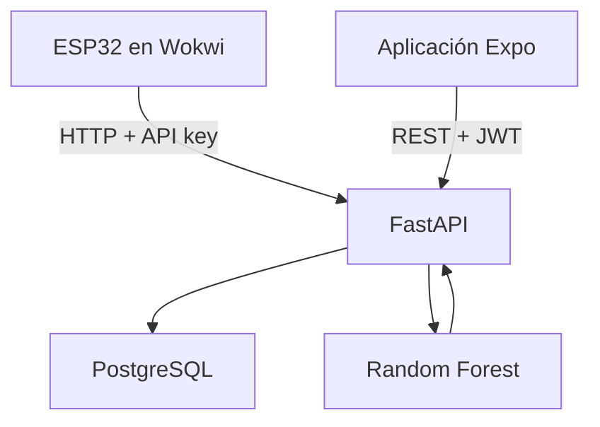

# AgroCoffee AI

Aplicación móvil para monitorear de forma inteligente el proceso de secado de
café mediante **IoT**, **inteligencia artificial** y análisis de datos en tiempo
casi real.

El prototipo recibe mediciones de un ESP32 simulado en Wokwi, almacena la
información en PostgreSQL, ejecuta un modelo Random Forest y muestra el estado
del secado, el tiempo restante, las gráficas y las alertas en una aplicación
React Native.

## Tecnologías

| Componente | Tecnología |
|---|---|
| Aplicación móvil | React Native, Expo SDK 57, TypeScript y Expo Router |
| Estilos | NativeWind/Tailwind CSS |
| Backend | Python 3.12, FastAPI y Uvicorn |
| Base de datos | PostgreSQL 17 |
| ORM y migraciones | SQLAlchemy 2 y Alembic |
| Inteligencia artificial | Scikit-learn y Random Forest |
| IoT | ESP32 simulado en Wokwi |
| Contenedores | Docker y Docker Compose |
| Autenticación | JWT, refresh tokens y Argon2 |

## Arquitectura general



## Funcionalidades disponibles

- Registro e inicio de sesión.
- Access token y refresh token almacenados de forma segura.
- Administración de lotes y procesos de secado.
- Registro y autenticación de dispositivos ESP32 mediante API key.
- Recepción de temperatura, humedad ambiental, humedad del café, luminosidad y
  tiempo transcurrido.
- Clasificación del secado como `FAVORABLE`, `SECADO_LENTO`, `DESFAVORABLE`
  o `COMPLETADO`.
- Estimación del tiempo restante y nivel de confianza.
- Generación y atención de alertas.
- Dashboard y gráficas actualizados automáticamente cada 10 segundos.
- Documentación interactiva OpenAPI/Swagger.

## Estructura del repositorio

```text
AgroCoffee-AI/
├── backend/             API, modelos, migraciones, pruebas e IA
├── frontend/            Aplicación móvil Expo/React Native
├── iot/wokwi/           Circuito y programa del ESP32 simulado
├── docker-compose.yml   Backend y PostgreSQL
├── .env.example         Variables de entorno de Docker
└── README.md
```

## Requisitos previos

Antes de comenzar, instalar:

- [Git](https://git-scm.com/downloads).
- [Docker Desktop](https://www.docker.com/products/docker-desktop/).
- [Node.js LTS](https://nodejs.org/) con npm.
- [Expo Go](https://expo.dev/go) en el teléfono Android o iOS.
- Una cuenta de [Wokwi](https://wokwi.com/) solamente si se probará el módulo
  IoT.

Docker Desktop debe estar abierto antes de ejecutar los servicios. Para probar
la aplicación en un teléfono físico, el teléfono y la computadora deben estar
conectados a la misma red Wi-Fi.

Los comandos siguientes están escritos para **Git Bash en Windows**.

## Instalación desde cero

### 1. Clonar el repositorio

```bash
git clone https://github.com/DanielPerezzz/AgroCoffee-AI.git
cd AgroCoffee-AI
```

Confirmar que se está utilizando la rama principal actualizada:

```bash
git switch main
git pull --ff-only origin main
```

### 2. Configurar las variables del backend

Crear `.env` a partir del ejemplo:

```bash
cp .env.example .env
```

Abrir `.env` y reemplazar las credenciales de ejemplo:

```env
POSTGRES_DB=agrocoffee
POSTGRES_USER=agrocoffee_user
POSTGRES_PASSWORD=una_clave_local_segura
SECRET_KEY=una_clave_jwt_aleatoria_de_al_menos_32_caracteres
```

`SECRET_KEY` debe contener al menos 32 caracteres. Los archivos `.env` no
deben subirse a GitHub.

Generar una clave secreta aleatoria con Python:

```bash
python -c "import secrets; print(secrets.token_hex(32))"
```

Copiar la cadena generada y reemplazar el valor de ejemplo en `.env`:

```env
SECRET_KEY=CADENA_GENERADA
```

Cada integrante puede utilizar una clave diferente en su entorno local. La
clave debe mantenerse igual mientras se use esa instalación, porque cambiarla
invalida los JWT existentes.

### 3. Construir e iniciar PostgreSQL y FastAPI

Desde la raíz del repositorio:

```bash
docker compose up -d --build
```

Comprobar los contenedores:

```bash
docker compose ps
```

Los servicios esperados son:

- `agrocoffee-database` en el puerto `5432`.
- `agrocoffee-backend` en el puerto `8000`.

### 4. Aplicar las migraciones de la base de datos

Desde Git Bash y la raíz del repositorio:

```bash
MSYS_NO_PATHCONV=1 docker compose run --rm --no-deps --volume ./backend:/app backend alembic upgrade head
```

Verificar la migración aplicada:

```bash
MSYS_NO_PATHCONV=1 docker compose run --rm --no-deps --volume ./backend:/app backend alembic current
```

La salida debe terminar mostrando una revisión con `(head)`.

### 5. Comprobar el backend

Abrir en el navegador:

- Estado: <http://localhost:8000/api/v1/health>
- Swagger: <http://localhost:8000/docs>

El endpoint de estado debe responder de forma similar a:

```json
{
  "status": "ok",
  "service": "agrocoffee-api",
  "version": "0.2.0",
  "database": "connected"
}
```

También puede comprobarse desde la terminal:

```bash
curl http://localhost:8000/api/v1/health
```

### 6. Instalar el frontend

```bash
cd frontend
npm install
```

### 7. Configurar la URL de la API para el teléfono

Obtener la dirección IPv4 de la computadora:

```bash
ipconfig
```

Buscar la dirección IPv4 del adaptador Wi-Fi, por ejemplo `192.168.1.25`.

Crear la configuración local del frontend:

```bash
cp .env.example .env.local
```

Editar `frontend/.env.local` y colocar la IPv4 real:

```env
EXPO_PUBLIC_API_URL=http://192.168.1.25:8000/api/v1
```

No utilizar `localhost` en el teléfono: desde el dispositivo, `localhost` se
refiere al propio teléfono y no a la computadora.

Antes de iniciar Expo, abrir en el navegador del teléfono:

```text
http://IP_DE_LA_COMPUTADORA:8000/api/v1/health
```

Si la respuesta aparece, el teléfono puede comunicarse con el backend.

### 8. Iniciar Expo

Desde `frontend`:

```bash
npx expo start --go --lan --clear
```

Escanear el código QR con Expo Go. Si Windows solicita permiso de red, permitir
el acceso en redes privadas.

## Primera prueba de la aplicación

1. Abrir la aplicación en Expo Go.
2. Seleccionar **Regístrate**.
3. Crear una cuenta con una contraseña de al menos ocho caracteres que incluya
   mayúscula, minúscula y número.
4. La primera cuenta registrada en una base de datos vacía recibe el rol
   `ADMINISTRADOR`.
5. Iniciar sesión y comprobar las pantallas Inicio, Monitoreo, IA, Alertas y
   Ajustes.

Al tratarse de una instalación nueva, todavía no existirán dispositivos,
procesos ni mediciones. La base de datos local de otro integrante no se incluye
en GitHub ni dentro de la imagen Docker.

## Preparar una demostración completa con IoT e IA

### 1. Registrar un dispositivo

1. Abrir <http://localhost:8000/docs>.
2. Utilizar el botón **Authorize** para iniciar sesión con el correo y la
   contraseña registrados.
3. Ejecutar `POST /api/v1/dispositivos` con un cuerpo como:

```json
{
  "nombre": "ESP32 principal",
  "codigo": "ESP32-001",
  "tipo": "ESP32",
  "ubicacion": "Área de secado 1"
}
```

La respuesta incluye `id_dispositivo` y `api_key`. La API key se muestra
completa únicamente al crear el dispositivo o rotar su clave; debe guardarse
para configurar Wokwi.

### 2. Crear un lote e iniciar un proceso

Desde la aplicación:

1. Abrir **Ajustes**.
2. Seleccionar **Crear nuevo lote**.
3. Registrar el código, peso y humedad inicial.
4. Seleccionar **Iniciar proceso de secado**.
5. Elegir el lote, el dispositivo y el método.
6. Anotar el número del proceso mostrado en el dashboard.

### 3. Exponer temporalmente FastAPI para Wokwi Web

Wokwi Web no puede acceder directamente a `localhost` ni a la IP privada de la
computadora. Debe utilizarse una URL HTTPS pública temporal, por ejemplo con
Cloudflare Tunnel:

```bash
cloudflared tunnel --url http://localhost:8000
```

Mantener esa terminal abierta y copiar la URL HTTPS generada. Si se reinicia el
túnel, normalmente se obtiene otra URL y debe actualizarse la configuración de
Wokwi.

### 4. Configurar Wokwi

Los archivos necesarios están en [`iot/wokwi`](iot/wokwi).

1. Crear un proyecto ESP32 en <https://wokwi.com/projects/new/esp32>.
2. Copiar `sketch.ino`, `diagram.json` y `libraries.txt` al proyecto.
3. Crear `config.h` tomando como base `config.example.h`.
4. Completar la URL pública, API key e identificadores reales:

```cpp
#pragma once

#define API_BASE_URL "https://URL-TEMPORAL.trycloudflare.com/api/v1"
#define DEVICE_API_KEY "API_KEY_DEL_DISPOSITIVO"
#define DEVICE_ID 1
#define PROCESS_ID 1

#define INITIAL_ELAPSED_HOURS 36.0
#define SIMULATED_HOUR_MS 10000UL
#define SEND_INTERVAL_MS 10000UL
```

5. Iniciar la simulación y abrir el monitor serial.

Cada diez segundos Wokwi enviará una medición. FastAPI la almacenará, ejecutará
la IA y devolverá la predicción. La aplicación móvil consulta el backend cada
diez segundos, por lo que los cambios aparecen con una pequeña demora.

La guía específica del circuito está disponible en
[`iot/wokwi/README.md`](iot/wokwi/README.md).

## Pruebas del proyecto

### Backend

Desde la raíz:

```bash
MSYS_NO_PATHCONV=1 docker compose run --rm --no-deps --volume ./backend:/app backend pytest -q
```

### Frontend

```bash
cd frontend
npx tsc --noEmit
npx expo-doctor
```

## Comandos útiles

Ver el estado de los contenedores:

```bash
docker compose ps
```

Consultar los registros del backend:

```bash
docker compose logs -f backend
```

Reiniciar el backend después de cambiar su código:

```bash
docker compose up -d --build backend
```

Detener los contenedores conservando los datos:

```bash
docker compose down
```

Detener los contenedores y eliminar la base de datos local:

```bash
docker compose down -v
```

> [!WARNING]
> El último comando elimina definitivamente el volumen local de PostgreSQL.

## Solución de problemas

### La aplicación muestra un error de red

- Confirmar que Docker Desktop está abierto.
- Ejecutar `docker compose ps` y verificar que ambos contenedores estén activos.
- Revisar que `frontend/.env.local` contenga la IPv4 actual de la computadora.
- Confirmar que el teléfono y la computadora estén en la misma red Wi-Fi.
- Probar el endpoint `/api/v1/health` desde el navegador del teléfono.
- Permitir Node.js, Expo y Docker en el firewall de redes privadas de Windows.
- Reiniciar Expo con `npx expo start --go --lan --clear` después de cambiar el
  archivo de entorno.

### La API funciona, pero no aparecen datos

- Comprobar que exista un proceso en estado `EN_PROCESO`.
- Confirmar que `DEVICE_ID` y `PROCESS_ID` coincidan con PostgreSQL.
- Revisar que la API key del dispositivo sea correcta.
- Mantener activos el backend, el túnel y la simulación de Wokwi.
- Observar el monitor serial; la API debe responder con `HTTP 201`.

### El backend se apaga o reinicia

Consultar el error con:

```bash
docker compose logs --tail=100 backend
```

### Las tablas no existen

Volver a ejecutar:

```bash
MSYS_NO_PATHCONV=1 docker compose run --rm --no-deps --volume ./backend:/app backend alembic upgrade head
```

## Seguridad

- No subir `.env`, `.env.local` ni `iot/wokwi/config.h`.
- No publicar contraseñas, `SECRET_KEY`, JWT ni API keys.
- Rotar la API key del dispositivo después de una demostración pública si fue
  expuesta.
- Las variables con prefijo `EXPO_PUBLIC_` son visibles dentro de la aplicación
  compilada y no deben contener secretos.

## Estado actual

AgroCoffee AI es un prototipo académico funcional. La integración actual
demuestra el recorrido completo **sensores IoT → API → PostgreSQL → IA → app
móvil**. La actualización de la app se realiza mediante consultas periódicas
cada diez segundos; una mejora futura sería utilizar WebSockets y seleccionar
automáticamente el proceso activo desde el ESP32.
